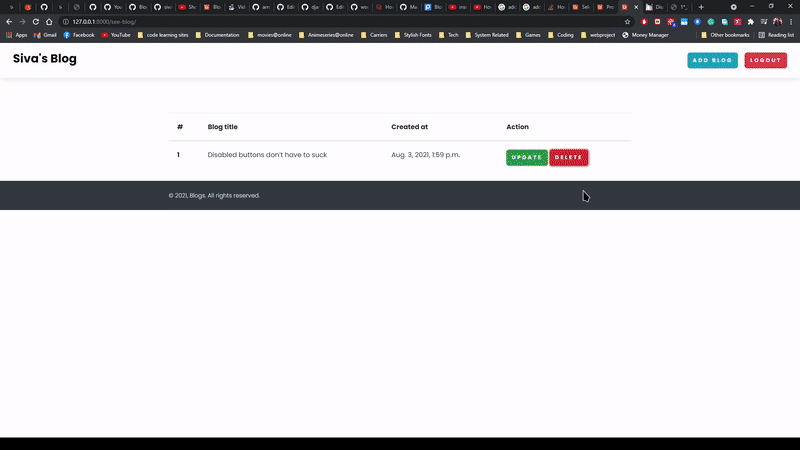
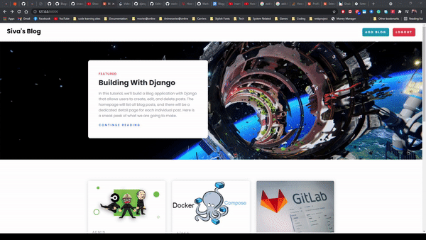
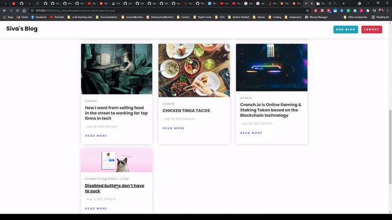

## Blog WebSite using DJANGO / REST API

### Blog App Supports:

- [Register](#register) / [Login](#login)
- [View Blogs](#view-blogs)
- [Post Blogs](#post-blogs)
- [Update Blog](#update-blog)
- [View list of Blogs](#view-list-of-blogs)
- [Remove Blog](#remove-blog)

### Info about App Development and Usage.
- To Build this app, For Back-End I used Python language & Django framework.
- For Front-End, I used HTML-5, CSS-3 & JavaScript.
- I used db.sqlite3 data base to store data. 
- To access, authenticate and process the user/app information, I used rest API's.
- All the necessary files required to execute this program can be found in requirement.txt
  and can be installed using the below command.
```python
                        -"pip install requirment.txt"
```

## Screenshots
- Blog APP Screenshots.

#### Register
<p align="left">
<a href="" target="_blank">  </a>
</p>

#### Login
<p align="left">
<a href="" target="_blank">  </a>
</p>

#### View Blogs

<p align="left">
<a href="" target="_blank">  </a>
</p>

#### Post Blogs

<p align="left">
<a href="" target="_blank">  </a>
</p>

#### Update Blog

<p align="left">
<a href="" target="_blank">  </a>
</p>

#### View list of Blogs

<p align="left">
<a href="" target="_blank">  </a>
</p>

#### Remove Blog

<p align="left">
<a href="" target="_blank">  </a>
</p>